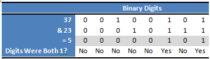

# Bitwise Operator

### Overview

Bitwise operators are operators that operates on binary level.
```python
& (bitwise AND)
| (bitwise OR)
~ (bitwise NOT)
^ (bitwise XOR)
<< (bitwise left shift)
>> (bitwise right shift)
>>> (bitwise unsigned right shift)
&= (bitwise AND assignment)
|= (bitwise OR assignment)
^= (bitwise XOR assignment)
<<= (bitwise left shift and assignment)
>>= (bitwise right shift and assignment)
>>>= (bitwise unsigned right shift and assignment)
```

___

## The & Operator
The AND operator. A quick heads-up though: normally, `ints` and `uints` take up 4 bytes or 32 bits of space. This means each int or uint is stored as 32 binary digits. For the sake of this tutorial, we'll pretend sometimes that `ints` and `uints` only take up 1 byte and only have 8 binary digits.

The & operator compares each binary digit of two integers and returns a new integer, with a 1 wherever both numbers had a 1 and a 0 anywhere else. A diagram is worth a thousand words, so here's one to clear things up. It represents doing `37 & 23`, which equals `5`.



Notice how each binary digit of 37 and 23 are compared, and the result has a 1 wherever both 37 and 23 had a 1, and the result has a 0 otherwise. (use the `'&'` truth table)

A neat little use of the & operator is to check whether a number is even or odd. For integers we can simply check the rightmost bit (also called the least significant bit) to determine if the integer is odd or even. This is because when converting to base 10, the rightmost bit represents 20 or 1. When the rightmost bit is 1, we know that our number is odd since we're adding 1 to a bunch of powers of two which will always be even. When the rightmost bit is 0, we know our number will be even, since it simply consists of adding up a bunch of even numbers.

```python
def odd_even(x: int) -> str:
    if x & 1:
        return "odd"
    else:
        return "even"
```

As per Jason `"On my computer, this method was about 66% faster than using randInt % 2 to check for even and odd numbers. That's quite a performance boost!"`

## The | Operator
The bitwise OR operator, |. As you may have guessed, the | operator is to the || operator as the & operator is to the && operator. The | operator compares each binary digit across two integers and gives back a 1 if either of them are 1. Again, this is similar to the || operator with booleans.
___

### References:
[Understanding Bitwise Operators](https://code.tutsplus.com/articles/understanding-bitwise-operators--active-11301) by Jason Killian