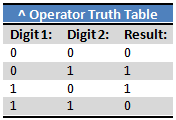

# Bitwise Operator

### Overview

Bitwise operators are operators that operates on binary level.
```python
# Bitwise operator
& (bitwise AND)
| (bitwise OR)
~ (bitwise NOT)
^ (bitwise XOR)
<< (bitwise left shift)
>> (bitwise right shift)
# Bitwise operator and Assignment
&= (bitwise AND assignment)
|= (bitwise OR assignment)
^= (bitwise XOR assignment)
<<= (bitwise left shift and assignment)
>>= (bitwise right shift and assignment)
```

___

## The `&` Operator
The AND operator. A quick heads-up though: normally, `ints` and `uints` take up 4 bytes or 32 bits of space. This means each int or uint is stored as 32 binary digits. For the sake of this tutorial, we'll pretend sometimes that `ints` and `uints` only take up 1 byte and only have 8 binary digits.

The `&` operator compares each binary digit of two integers and returns a new integer, with a 1 wherever both numbers had a 1 and a 0 anywhere else. A diagram is worth a thousand words, so here's one to clear things up. It represents doing `37 `&` 23`, which equals `5`.


Notice how each binary digit of 37 and 23 are compared, and the result has a 1 wherever both 37 and 23 had a 1, and the result has a 0 otherwise. (use the `&` truth table)


A neat little use of the `&` operator is to check whether a number is even or odd. For integers we can simply check the rightmost bit (also called the least significant bit) to determine if the integer is odd or even. This is because when converting to base 10, the rightmost bit represents 20 or 1. When the rightmost bit is 1, we know that our number is odd since we're adding 1 to a bunch of powers of two which will always be even. When the rightmost bit is 0, we know our number will be even, since it simply consists of adding up a bunch of even numbers.

```python
def odd_even(x: int) -> str:
    if x & 1:
        return "odd"
    else:
        return "even"
```

As per Jason `"On my computer, this method was about 66% faster than using randInt % 2 to check for even and odd numbers. That's quite a performance boost!"`

## The `|` Operator
The bitwise OR operator. As you may have guessed, the `|` operator is to the `||` operator as the `&` operator is to the `&&` operator. The `|` operator compares each binary digit across two integers and gives back a 1 if either of them are 1. Again, this is similar to the `||` operator with booleans.


Let's take a look at a possible situation. We're building a pop-up window class. At the bottom of it, we can have a Yes, No, Okay, or Cancel button or any combination of those - how should we do this?


```python
class PopupWindow():

    def __init__(self):
        self.YES = 1
        self.NO = 2
        self.OKAY = 4
        self.CANCEL = 8

    def show(buttons: int):
        if buttons & self.YES:
            # show Yes button
        if buttons & self.NO:
            # show No button
        if buttons & self.OKAY:
            # show Ok button
        if buttons & self.CANCEL:
            # show Cancel button

# Function call
PopupWindow.show(PopupWindow.YES | PopupWindow.NO | PopupWindow.CANCEL);
```
What's going on? It's important to note that our constants in the second example are all powers of two. So, if we look at their binary forms, we will notice they all have one digit equal to 1, and the rest equal to 0. In fact, they each have a different digit equal to 1. This means that no matter how we combine them with `|`, every combination will give us a unique number. Looking at it in a different way, out result of our `|` statement will be a binary number with a 1 wherever our options had a 1.

For our current example we have `PopupWindow.YES | PopupWindow.NO | PopupWindow.CANCEL` which is equivalent to `1 | 2 | 8` which rewritten in binary is `00000001 `|` 00000010 `|` 00001000` which gives us a result of `00001011`.

Now, in our `showPopup()` function, we use `&` to check which options were passed in. For example, when we check `buttons & YES`, all the bits in YES are equal to 0 except the very rightmost one. So, we are essentially checking if the rightmost bit in buttons is a 1 or not. If it is, `buttons & YES` will not equal 0 and anything in the if statement will be executed. Conversely, if the rightmost bit in buttons is 0, buttons `&` YES will equal 0, and the if statement will not be executed.


## The `~` Operator

The bitwise NOT operator is slightly different than the two we've looked at so far. Instead of taking an integer on each side of it, it takes an integer only after it. This is just like the ! operator, and, not surprisingly, it does a similar thing. In fact, just as ! flips a boolean from `true` to `false` or vice versa, the ~ operator reverses each binary digit in an integer: from 0 to 1 and 1 to 0:


A quick example. Say we have the integer `37`, or `00100101`. `~37` is then `11011010`. What's the base 10 value of this? Well...

### Two's Complement, `uint` vs `int`

Now the fun begins! We're going to take a closer look at binary numbers on a computer. Let's start with the uint. As mentioned before, a uint is typically 4 bytes or 32 bits long, meaning it has 32 binary digits. This is easy to understand: to get the base 10 value we simply convert the number to base 10 regularly. We'll always get a positive number.

But how about the int? It also uses 32 bits, but how does it store negative numbers? If you guessed that the first digit is used to store the sign, you're on the right path. Let's take a look at the two's complement system for storing binary numbers. While we won't go into all the details here, a two's complement system is used because it makes binary arithmetic easy.

To find the two's complement of a binary number, we simply flip all the bits (i.e. do what the `~` operator does) and add one to the result. Let's try this out once:


We then define our result as the value -37. Why do this complicated process and not just flip the very first bit and call that -37?

Well, let's take a simple expression 37 + -37. We all know this should equal 0, and when we add the 37 to its two's complement, that's what we get:


Notice that since our integers only hold eight binary digits, the 1 in our result is dropped, and we end up with 0, as we should.

There is also a little shortcut to do this by hand: starting from the right, work to the left until you reach a 1. Flip all the bits to the left of this first 1.


When we're looking at a signed binary number (in other words, one that can be negative, an int not a uint), we can look at the leftmost digit to tell whether it's negative or positive. If it's a 0, then the number is positive and we can convert to base 10 simply by calculating its base 10 value. If the leftmost bit is a 1, then the number is negative, so we take the two's complement of the number to get its positive value and then simply add a negative sign.

For example, if we have 11110010, we know it is a negative number. We can find it's two's complement by flipping all the digits to the left of the rightmost 1, giving us 00001110. This equals 13, so we know 11110010 equals -13.

## The `^` Operator

The bitwise XOR operator. There is no equivalent boolean operator to this one.

The `^` operator is similar to the `&` and `|` operators in that it takes an `int` or `uint` on both sides. When it is calculating the resulting number, it again compares the binary digits of these numbers. If one or the other is a 1, it will insert a 1 in to the result, otherwise it will insert a 0. This is where the name XOR, or "exclusive or" comes from.



Let's take a look at our usual example:


The ^ operator does have uses - it's especially good for toggling binary digits - but we won't cover any practical applications in this article.


___

### Reference Article:
[Understanding Bitwise Operators](https://code.tutsplus.com/articles/understanding-bitwise-operators--active-11301) by Jason Killian